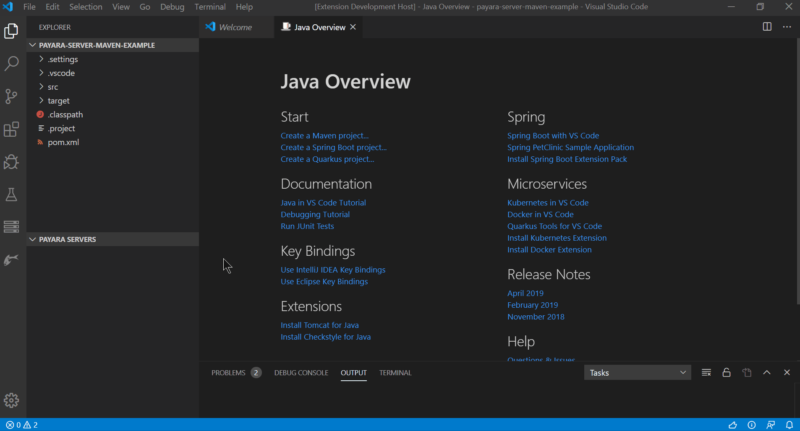
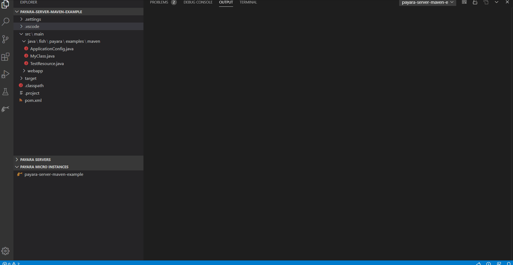

# Payara Tools for VS Code

## Features

### Payara Server
* Add Payara Server
* Start Payara Server
* Start Payara Server in debug mode
* Stop Payara Server
* Rename Payara Server
* Create Payara Server domain
* Update Admin server credentials
* Customize JDK path
* Open Admin console homepage in browser
* View Payara Server log
* Open Payara domain.xml
* Run war package
* Debug war package
* Run exploded war
* Debug exploded war
* Open deployed application homepage in browser
* Enable/Disable/Undeploy application

#### Usage

### Payara Micro
* Supports Maven Web Application project
* Start Payara Micro instance
* Start Payara Micro instance in debug mode
* Stop Payara Micro instance
* Create an UberJAR of the application and Payara Micro
* Run/Debug war package
* Run/Debug uberjar package
* Run/Debug exploded war package
* Reload exploded war package on save
* Open deployed application homepage in browser

#### Usage

